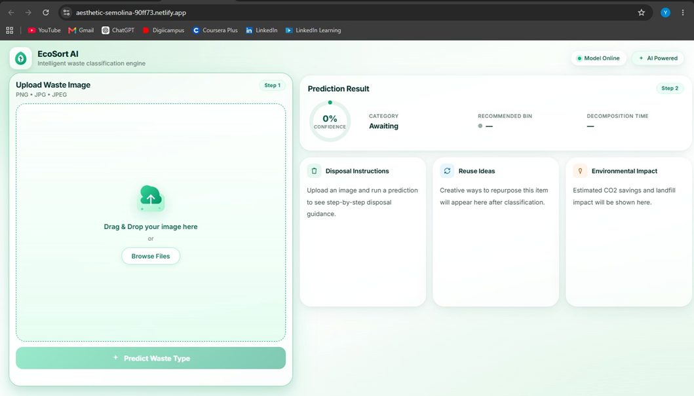
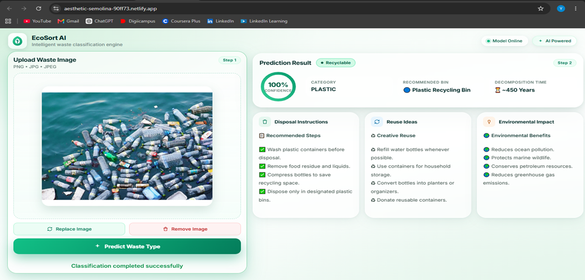
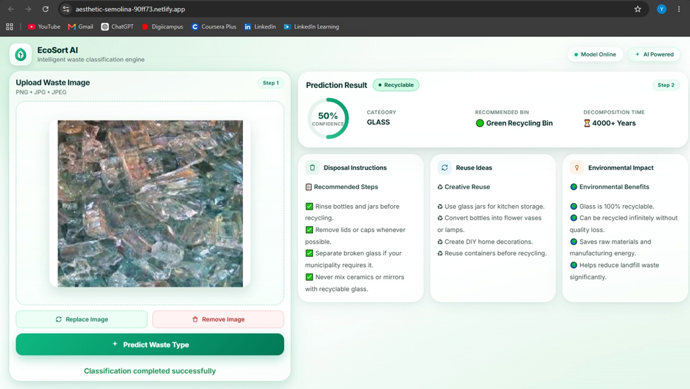

# EcoSort AI

AI-powered waste classification and recycling recommendation system built using TensorFlow, Keras, FastAPI, HTML, CSS, and JavaScript.

## Features

- Classifies waste into six categories:
  - Cardboard
  - Glass
  - Metal
  - Paper
  - Plastic
  - Trash
- Deep Learning image classification
- Recycling recommendations
- FastAPI backend
- Responsive frontend
- Cloud deployment

## Screenshots

### Home Page



### Glass Classification



### Plastic Classification



## Tech Stack

- Python
- TensorFlow
- Keras
- FastAPI
- HTML
- CSS
- JavaScript
- Git
- GitHub
- Render
- Netlify

## Project Structure

```text
EcoSort-AI/
├── backend/
├── model/
├── screenshots/
│   ├── home-page.png
│   ├── glass-classification.png
│   └── plastic-classification.png
├── index.html
├── style.css
├── script.js
├── runtime.txt
├── .gitignore
├── .gitattributes
└── README.md
```

## Author

**Yash Agarwal**
